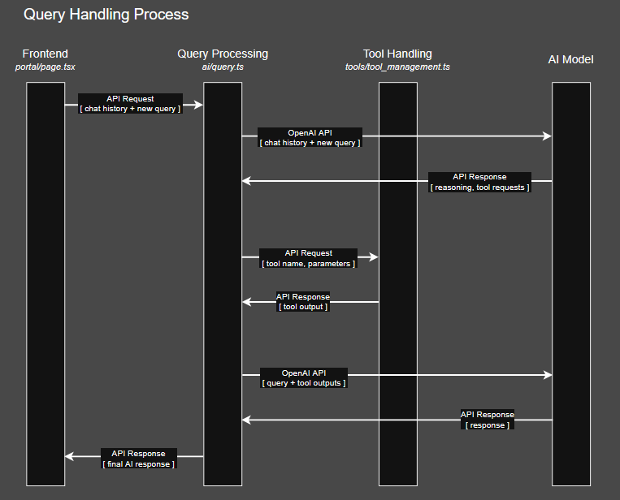

# LLM Query Processing and Tool Handling



## LLM Query

Query processing occurs in [query.ts](./query.ts). In this file you can

- Edit which model is used for queries
- Change the initial system prompt.

## Tool Handling

The tools that the LLM has access to use are managed in [tools/tool_management.ts](./tools/tool_management.ts). This file holds the definitions for all tools, and each tool has the files for it's usage in its own folder.

## Adding a New Tool

1) Write the tool definition in [tools/tool_management.ts](./tools/tool_management.ts). There is a skeleton example of a tool definition at the top of the file. For example, below is the definition for the terminology tool. It takes a single string term as a required input parameter.

```
const wildfireTerminologyTool =
    {
        type: "function",
        name: "get_wildfire_term",
        description: "Get the definition of a term related to wildires.",
        parameters: {
            type: "object",
            properties: {
                term: {
                    type: "string",
                    description: "A term related to wildfires like fuel or prescribed fire",
                },
            },
            required: ["term"],
        },
    };
```

2) Add the tool definition to the `query_tools` array, cast as a `Tool`.

```
export const query_tools = [
    wildfireTerminologyTool as Tool, 
];
```

3) Create a directory for your tool under the `tools` directory, and add files to execute your tool's functionality. You will at least need a function exported that takes the input parameter defined by your tool definition. 

For example, [tools/terminology_tool/handle_get_wildfire_term.ts](./tools/terminology_tool/handle_get_wildfire_term.ts) contains the function `getWildfireTerm` that takes a single string parameter and returns the definition of that term if it exists in the database.

3) Import the function for your tool in `query.ts` and add an if statement to handle calling of your tool in the `make_tool_calls` function. 

```
import { getWildfireTerm } from "./terminology_tool/handle_get_wildfire_term";

...

export async function make_tool_calls(tool_call_list: ResponseFunctionToolCall[]) {
    var tool_output = [] as ResponseInput;

    for (const item of tool_call_list) {

        if (item.name == "get_wildfire_term") {
            const def = await getWildfireTerm(JSON.parse(item.arguments).term)
            tool_output.push(item);

            tool_output.push({
                type: "function_call_output",
                call_id: item.call_id,
                output: def // This needs to be a string value or you will get an API error
            });
        }
    };

    return tool_output;
}
```
